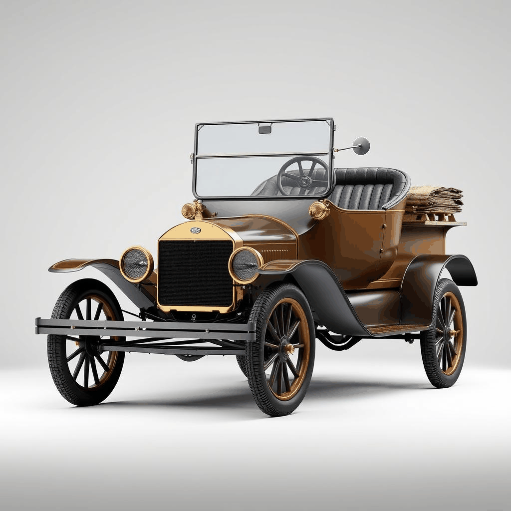

# TimeMetamorphy

Have you ever wondered what life was like 20, 30, 40, or even 100 years ago? How did our parents communicate? What did their phones and cars look like? 
Isn’t it amazing to see how much things have changed and evolved over time? And even more mind-blowing imagining what the future might look like!

### **Unlocking the secrets of time!**

This project unveils these mysteries by offering a unique/magic lens that allows us "time travel". Powered by AI agents equipped with cutting-edge tools, it provides the superpower to explore the past, witness the present, and dream up the future like never before.  

 ### Index:
- [Setup](#Setup)
- [Usage](#Usage)
- [Methods](#Methods)
- [Results](#results)
- [Repository_files](#Repository_files)
- [Acknowledgements](#Acknowledgements)

  <figure style="margin: 10px; text-align: center;">
    
  </figure>
  <figure style="margin: 10px; text-align: center;">
    
  </figure>
  <figure style="margin: 10px; text-align: center;">
    
  </figure>

[APP](https://huggingface.co/spaces/AMfeta99/Object_Evolution_Generator)

